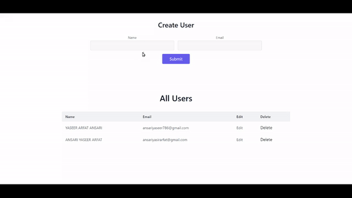

# MERN Project with CRUD functionalities

This is a simple MERN (MongoDB, Express.js, React, Node.js) stack project with a user interface powered by Tailwind CSS. The project allows users to enter their name and email in a form, send the data to the backend server via an API call, and store the information in a MongoDB database. The entered user data is then displayed below the form on the screen.

## Live Links

- Frontend (Client): [Live Link](https://mern-crud-assignment.vercel.app)
- Backend (Server): [Live Link](https://mern-crud-0bm0.onrender.com)

## Demo



## Prerequisites

Before running the project, make sure you have the following installed on your machine:

- Node.js and npm (Node Package Manager) [Download here](https://nodejs.org/en/download/)
- MongoDB [Download here](https://www.mongodb.com/try/download/community)

## Getting Started

1. Clone the repository to your local machine:

```
git clone https://github.com/AnsariYasirArfat/mern-crud-assignment
```

2. Navigate to the project directory:

```
cd <project-directory>
```

3. Install the required dependencies for both the frontend and backend:

```
cd client
npm install

cd ../server
npm install
```

## Configuration

1. Create a `.env` file in the `server` directory and set the following environment variables:

```
MONGO_URI=<your-mongodb-uri>
```

Replace `<your-mongodb-uri>` with your actual MongoDB connection string. Make sure to create a MongoDB database and provide the URI accordingly.

2. Additionally, you can configure other environment variables as needed in the `.env` file.

## Starting the Application

1. Open a terminal and start the backend server:

```
cd server
npm start
```

2. Open another terminal and start the frontend development server:

```
cd client
npm start
```

3. Your application should now be running. Visit `http://localhost:3000` in your web browser to access the application.

## Tech Stack

- Frontend: React, Tailwind CSS
- Backend: Node.js, Express.js, MongoDB

## Project Structure

```
.
├── client
│   ├── public
│   ├── src
│   │   ├── components
│   │   ├── App.js
│   │   ├── index.js
│   │   └── ...
│   ├── package.json
│   └── ...
├── server
│   ├── config
│   │   ├── db.js
│   ├── controllers
│   │   ├── userController.js
│   ├── models
│   │   ├── userModel.js
│   │   └── ...
│   ├── routes
│   │   ├── userRoutes.js
│   │   └── ...
│   ├── app.js
│   ├── server.js
│   ├── package.json
│   └── ...
├── .env (create this file in the 'server' directory)
├── README.md
└── ...
```
